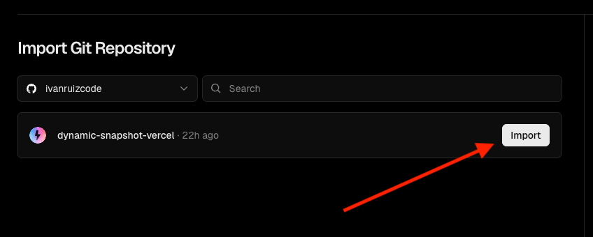
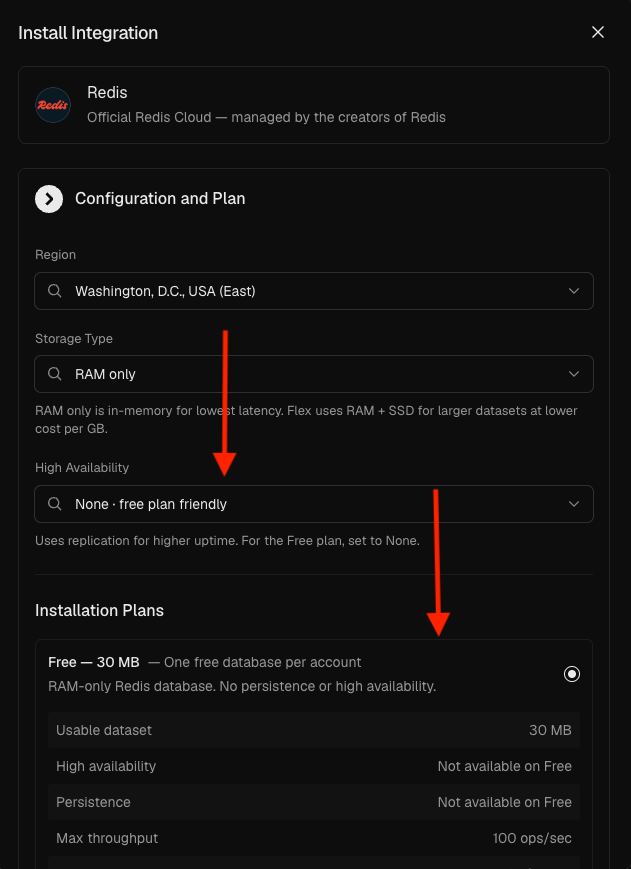
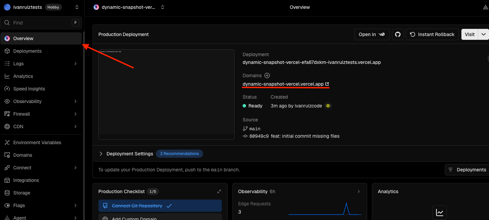
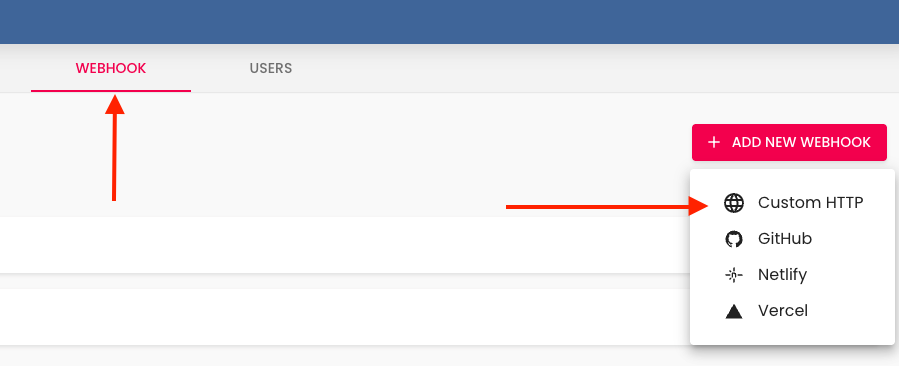
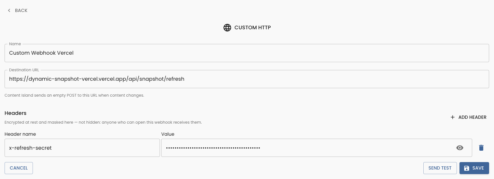

# Dynamic Snapshot en Vercel

# Paso 0: Crea un repositorio de GitHub con el código de tu proyecto

Antes de empezar, debes de tener el código de `01-local` subido en un repositorio de GitHub. Es el punto de partida para este ejemplo. El código es el mismo, pero ahora toca desplegarlo en Vercel junto con Redis.

# Paso 1: Crear proyecto en Vercel

En la panel de vercel, con tu cuenta de GitHub conectada, haz click en el botón de `Add New` y selecciona `Project`:

Se te abirá una nueva página donde podrás seleccionar el repositorio que acabas de subir a GitHub. Selecciona el repositorio y haz click en `Import`:

Una vez hayas importado el proyecto, Vercel te mostrará una nueva ventana donde podrás configurar de forma básica el proyecto. En este caso, solo debemos de cambiar las variables de entorno:

 

Aquí podemos añadir las variables de entorno de forma manual:
    - CONTENT_ISLAND_ACCESS_TOKEN: Es el token de lectura de tu proyecto de Content Island, lo puedes encontrar en la sección `General` de tu proyecto de Content Island.
    - CONTENT_ISLAND_PROJECT_ID: (Opcional) Solo prefija la clave de Redis, para que dos entornos que apunten aproyectos distintos de Content Island puedan compartir una misma instancia.
    - REDIS_URL: La URL de tu instancia de Redis. La dejamos vacia por ahora hasta que la creemos en el siguiente paso.
    - SNAPSHOT_REFRESH_SECRET: Una clave secreta que se usará para refrescar los snapshots de forma segura. Puedes generar una clave aleatoria con el comando `openssl rand -hex 32` en tu terminal.
    - SNAPSHOT_CHECK_INTERVAL_MS: El intervalo de tiempo en milisegundos para comprobar si hay cambios en el contenido. En producción, puedes poner 300000 (5 minutos) y en desarrollo, puedes poner 10000 (10 segundos) para que se refresque más rápido y comprobar que funciona.

Una vez terminado de añadir las variables de entorno, haz click en `Crear`.

# Paso 2: Crear una instancia de Redis en Vercel

Ahora vamos a crear una instancia de Redis en Vercel. Para ello, dentro del panel del proyecto dirigete a Storage y dentro de Marketplace Database Providers selecciona Redis. 

Dentro de la pantalla de Install Integration, configura la region el tipo de almacenamiento y la disponibilidad de la instancia. Vermos como todos los planes de instalación son de pago, pero Vercel ofrece un plan gratuito al seleccionar en la opción de `High Availability` la opción de **None — free plan friendly**. Una vez terminado, haz click en el botón de continuar.

Ahora vamos con la confirmación para crear la instancia, donde ponemos el nombre de la instancia y hacemos click en `Create`:

Una vez creado Vercel nos pedira asignar un projecto y un prefijo para la variable de entorno de la URL de Redis. No le podemos poner el mismo nombre que la que ya tenemos creado, así que le pondremos "STORAGE_REDIS_URL".

Una vez hecho esto, podemos copiar la URL de Redis y pegarla en la variable de entorno del proyecto.

Una vez configurado nos saltara un mensaje en la parte inferior izquierda diciendo que la variable de entorno ha sido actualizada y que podemos hacer un redeploy para hacerle efecto y le daremos click en `Redeploy` para que se haga efectivo.

# Paso 3: Configurar el Custom HTTP Webhook en Content Island

Para el siguiente paso, necesitamos obtener la URL de nuestro proyecto desplegado en Vercel. Para ello, vamos a la sección de `Overview` y copiamos la URL del proyecto.

Una vez estamos en Content Island, vamos a la sección de `Webhooks` y hacemos click en `Add Webhook` y seleccionamos `Custom HTTP Webhook`.

En el formulario de creación hay 2 partes, la primera es la configuración del webhook, donde debemos de poner el nombre del webhook y más abajo la URL de nuestro proyecto desplegado.

Abajo tenemos la sección de `Headers` donde debemos de añadir un header con el nombre `x-refresh-secret` y el valor de la variable secreata.

# Paso 4: Comprobación de funcionamiento

Podemos probar de dos formas diferentes que el webhook funciona correctamente. La primera es haciendo click en el botón de `Send Test` dentro del webhook:

Y después viendo los logs de Vercel, donde veremos que se ha recibido la petición:

La segunda forma es haciendo un cambio en el contenido de Content Island y viendo que se refresca el snapshot automáticamente. Para ello, vamos a la sección de `Content` y hacemos cualquier cambio. Una vez dentro, hacemos un cambio publicamos. Una vez publicado Content Island enviará la petición al webhook y Vercel refrescará el snapshot automáticamente. Podemos comprobarlo viendo los logs de Vercel o esperando a que se actualice la página y ver que el contenido ha cambiado.